# AI News Stream

[](https://github.com/donetian-petkov/ai_news_deploy_ready/actions/workflows/ci.yml)


A real-time, multi-column news dashboard. RSS, Reddit and YouTube feeds stream in live, and AI adds summaries, research, and a per-story chat.

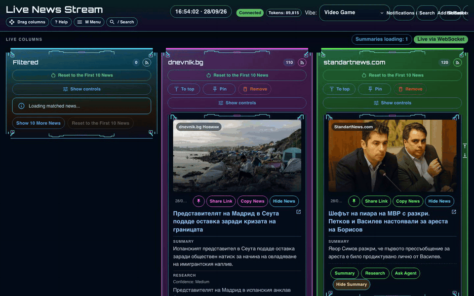

## Features

- **Live columns** — one column per feed, updated over WebSocket, with drag-and-drop ordering, pinning, per-column polling, sorting and filters, plus a Filtered column for stories matching your keywords.
- **AI on every story** — summaries, long-form research and **Ask Agent**, a chat about one specific story. Optional insights: bias, headline risk, keywords, impact, perspectives, historical comparison, future scenarios, local impact.
- **Any provider** — OpenAI, Claude, OpenRouter, or a local OpenAI-compatible server. Keys are saved per account and encrypted at rest.
- **Discord delivery** — send each feed's new stories to its own Discord webhook, including the AI sections enabled for that feed.
- **Make it yours** — vibes (Video Game, Sci-Fi, Fantasy, Cyber Witch and more), color schemes, fonts, icon or text buttons, EN/BG interface, keyboard shortcuts, and a performance mode for slower machines. Preferences follow your account.

## See it in action

**AI analysis and Ask Agent on a story**

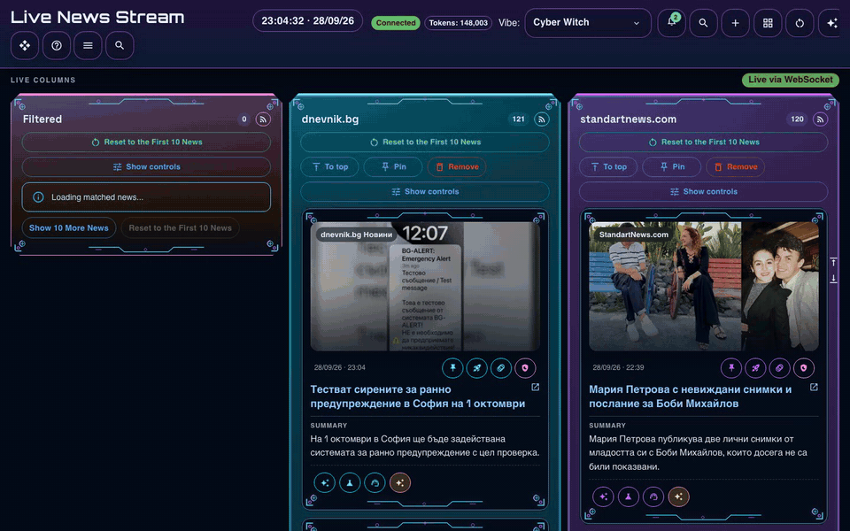

**Settings panel**

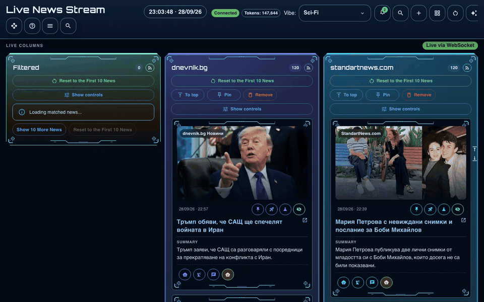

**Search** and **column controls on mobile**

<p>
  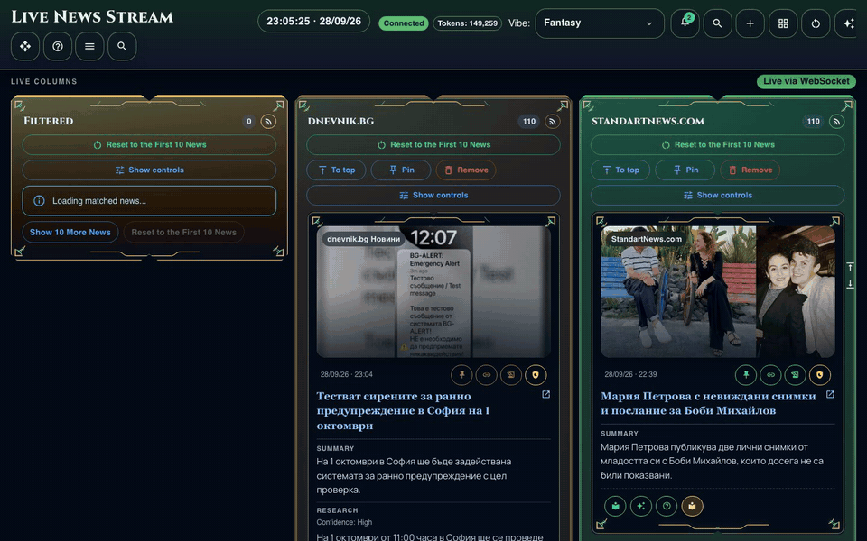
  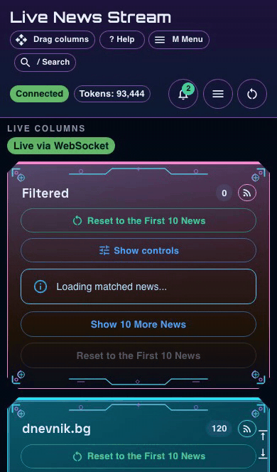
</p>

**Vibes**

| Video Game | Sci-Fi |
|---|---|
| 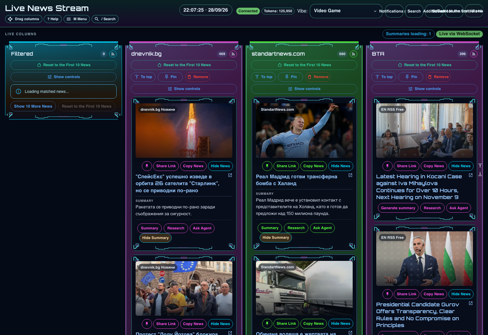 | 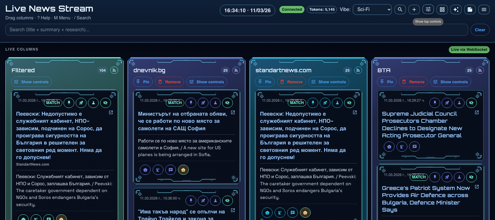 |
| **Fantasy** | **Cyber Witch** |
| 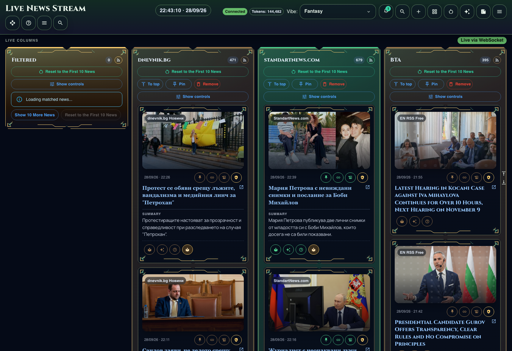 | 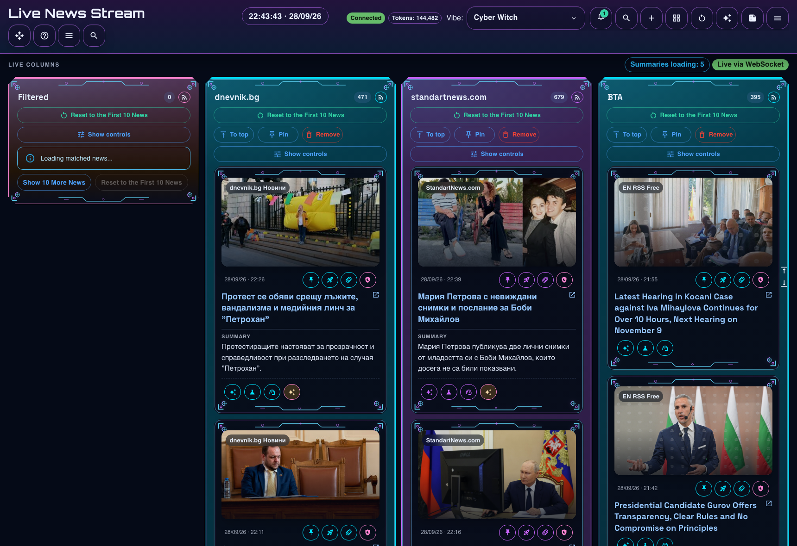 |

<details>
<summary>More screenshots: performance mode, settings, news cards, mobile</summary>

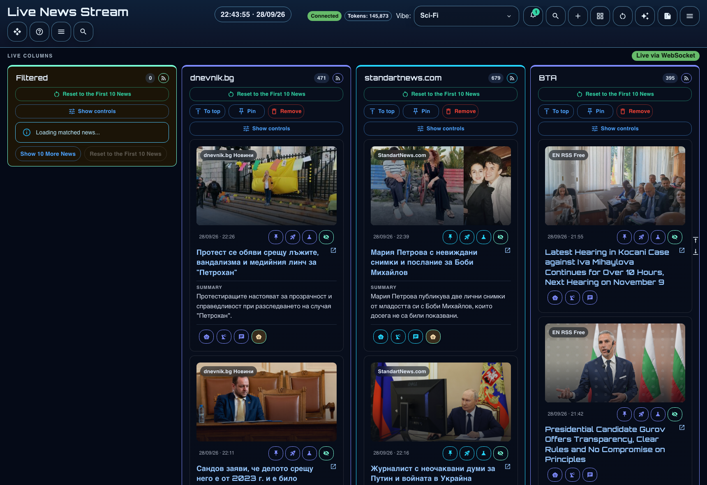
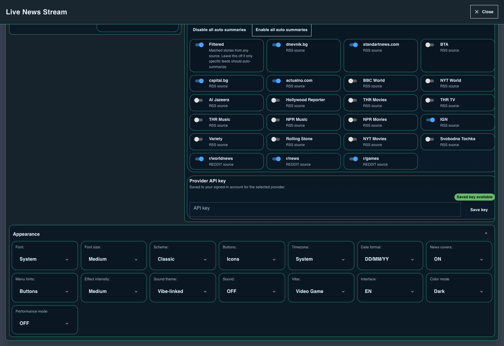

<p>
  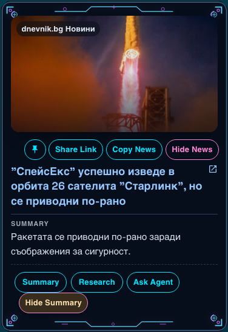
  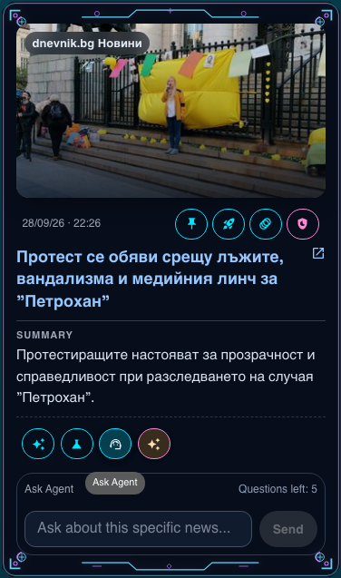
  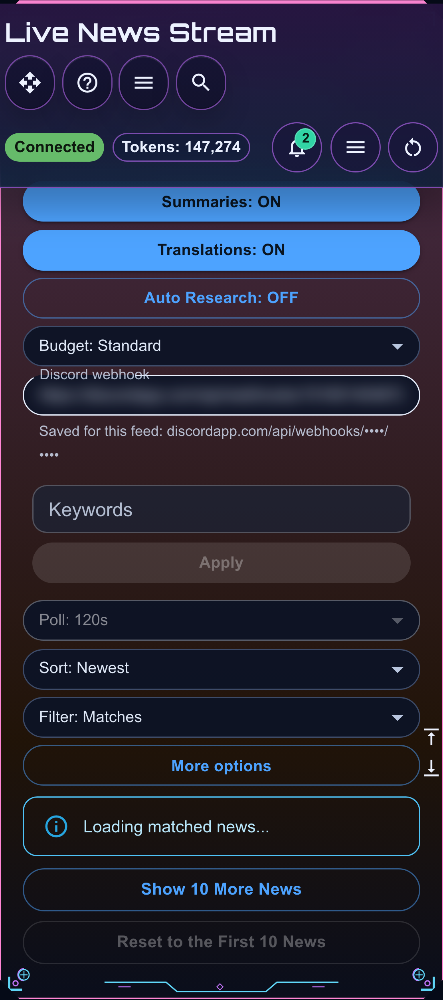
</p>

</details>

## Installation

### What you need

- **Node.js `22.12+`** (or `20.19+`) with **npm `10`**. Node 22 LTS includes npm 10; npm 11 may print engine errors.
- **Git**.
- An API key for OpenAI, Anthropic (Claude) or OpenRouter, or a local OpenAI-compatible model server.

### macOS and Linux

```bash
git clone https://github.com/donetian-petkov/ai_news_deploy_ready.git
cd ai_news_deploy_ready
cp .env.example .env
```

Open `.env` and replace `AUTH_TOKEN_SECRET` and `KEY_ENCRYPTION_SECRET` with two different random values. Run `openssl rand -hex 32` once for each. Add your `KEYWORDS` too if you want the Filtered column. Then:

```bash
npm run install:server   # installs packages, creates the database, builds everything
npm run dev              # starts the app with live reload
```

Open **http://localhost:3000**. The API runs on http://localhost:4000; `http://localhost:4000/health` confirms it's up.

### Windows

The project's npm scripts are written for a bash shell, so on Windows they run through **Git Bash**, which comes with Git for Windows.

1. Install Node.js and Git. In PowerShell:

   ```powershell
   winget install OpenJS.NodeJS.LTS
   winget install Git.Git
   ```

2. Tell npm to run scripts with Git Bash. This setting applies to all your npm projects; `npm config delete script-shell` undoes it:

   ```powershell
   npm config set script-shell "C:\Program Files\Git\bin\bash.exe"
   ```

3. Open **Git Bash** from the Start menu and follow the macOS and Linux steps above. `openssl` is included in Git Bash, and `notepad .env` opens the file for editing.

4. When Windows Firewall asks about Node.js the first time, allow it on private networks.

Stop the app with `Ctrl+C`. If port 3000 or 4000 is still busy afterwards, close the Git Bash window. On Windows, use `npm run start` in a Git Bash window instead of the background mode below.

### First run

Open the menu (`M`), register in **Account**, and save the API key for your provider. News starts flowing once you're signed in with a saved key, or straight after sign-in if you use a local provider. Your settings are saved to your account.

### Running it day to day

- `npm run dev`: development mode with live reload.
- `npm run build`, then `npm run start`: faster production mode. Rebuild after pulling changes or editing `NEXT_PUBLIC_*` values.
- `npm run server -- --background`: production mode in the background on macOS and Linux. `npm run server -- status` checks it and `npm run stop` stops it.

### With Docker

```bash
cp .env.example .env    # fill in the two secrets, as above
docker compose up -d --build
```

This runs both services and keeps the database in a Docker volume. `docker compose logs -f api` shows the logs, `docker compose down` stops everything, and `docker compose down -v` also deletes the database.

## Hosting online

The API must run all the time and keep a database file, so it needs a real server rather than a serverless host. The simplest setup is a small VPS (around €5 a month) with PM2 and Caddy for HTTPS. The free option is your own computer behind a Cloudflare Tunnel, which stays online only while the computer is awake.

Step-by-step guides: **[docs/hosting.md](./docs/hosting.md)**

## Configuration

| Variable | What it does |
|---|---|
| `AUTH_TOKEN_SECRET`, `KEY_ENCRYPTION_SECRET` | **Required.** Sign login tokens and encrypt saved API keys. Use two different long random values. |
| `KEYWORDS` | Comma-separated keywords for the Filtered column (`MATCH_THRESHOLD` tunes how strict matching is). |
| `NEXT_PUBLIC_WS_URL`, `NEXT_PUBLIC_API_URL` | Where browsers reach the API. Built into the web app, so rebuild after changing them. |
| `WEB_ORIGIN` | Allowed web origin for API requests (default `*`). Set it when hosting publicly. |
| `DATABASE_URL` | SQLite file (default `file:./dev.db`, i.e. `apps/api/prisma/dev.db`). |
| `PORT` | API port (default `4000`). |
| `AI_ENABLED`, `SUMMARY_LANG`, `RESEARCH_LANG` | Turn AI on or off and pick the summary (`bilingual`, `bg`, `en`) and research (`bg`, `en`) languages. |
| `OPENAI_*_MODEL`, `OPENROUTER_*_MODEL`, `OPENROUTER_BASE_URL` | Optional model and endpoint overrides. |

## Keyboard shortcuts

`?` or `H` help · `M` menu · `C` top controls · `G` all column controls · `S` search panel · `/` focus search · `A` add stream · `T` color mode · `V` vibe · `Esc` close help

## Development

```bash
npm run dev:web | npm run dev:api   # run one side only
npm run test                        # web + shared unit tests
npm run test:api                    # API integration tests
npm run test:e2e                    # Playwright smoke tests
```

The code is an npm workspace monorepo: `apps/api` (Express + ws: ingestion, matching, AI jobs, WebSocket), `apps/web` (Next.js + Redux Toolkit + MUI), and `packages/shared` (zod contracts shared by both). CI (`.github/workflows/ci.yml`) installs, migrates, tests and builds on every push.

To refresh the README media, start the app and run `npm run capture:readme` for screenshots and `node scripts/capture-readme-recordings.js` for the GIFs (needs `ffmpeg`). Both accept `CAPTURE_BASE_URL` when the app isn't on port 3000.

## Troubleshooting

- **UI says Disconnected while the API is healthy** — the web app was built with the wrong API address. Check `NEXT_PUBLIC_WS_URL` in `.env`, rebuild, and look for WebSocket errors in the browser console.
- **`bash` or `mkdir -p` errors on Windows** — npm isn't using Git Bash yet; see the Windows install steps.
- **`Environment variable not found: DATABASE_URL`** — add it to `.env`, then run `npm run prisma:generate && npm run prisma:migrate`.
- **AI shows as unavailable** — make sure a key is saved for the selected provider in **Account**, and restart the API after changing keys in `.env`.
- **Slow on your machine** — turn on Performance mode under Appearance, or open fewer columns.

Changelog: [RELEASE_NOTES.md](./RELEASE_NOTES.md)
