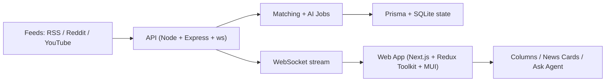

# AI News Stream (Next.js + Node)

[](https://github.com/donetian-petkov/ai_news_next_node/actions/workflows/ci.yml)


A real-time, multi-column news intelligence dashboard with AI summaries, AI research, Ask-Agent Q&A, advanced feed controls, and theme/vibe customization.

## Product Snapshot

| Area | What you get |
|---|---|
| Live ingestion | RSS / Reddit / YouTube streams over WebSocket |
| AI workflows | Summary, Research, Ask Agent (per-news contextual chat) |
| Stream control | Per-column budget, polling, sort, filters, pin/remove, age cleanup |
| UX controls | Top menu + mobile drawer, shortcuts, notifications, EN/BG interface |
| Personalization | Vibes, schemes, fonts, button modes, performance mode |
| Persistence | Prisma + SQLite for app/server state, localStorage for UI prefs |

## Core Features

### News + Columns
- Real-time column updates over WebSocket.
- Drag-and-drop column reordering.
- Filtered column for matched items.
- Per-column news limit behavior:
  - default visible count = 10
  - show +5 incrementally
  - reset back to 10 (column and global)

### AI Behaviors
- AI provider switching from UI (`OpenAI`, `Claude`, `OpenRouter`) with runtime key prompt.
- Summary and Research language controls.
- Per-column AI budget (`low`, `standard`, `high`) + global apply-all budget.
- Ask Agent per news item with remaining-question limits and contextual replies.
- Mood and Type filters (disabled automatically in performance mode).
- AI-off fallback behavior (UI indicates unavailable AI features).

### Interaction + UX
- Top quick actions: Search, Add Stream, Toggle controls/menu, hide all research/summaries.
- Notification modes:
  - only matched
  - matched + pinned columns
  - only pinned columns
  - all columns
- Stackable dismissible toasts for connection/feed problems.
- EN/BG interface.
- Responsive mobile drawer for top controls.

### Rendering + Performance
- Batched WebSocket updates to reduce render churn.
- Lazy hydration for below-fold columns.
- Dedicated performance mode for reduced visual overhead.
- Component split for maintainability (SOLID/DRY):
  - `ReactColumnsPreview` orchestrator
  - `FeedColumn` presenter
  - `NewsCard` presenter
  - extracted `top-menu/*` sections

## Architecture



## Monorepo Layout

```text
ai_news_next_node/
  apps/
    api/            # ingestion, matching, AI orchestration, websocket server
    web/            # Next.js client app + Redux + MUI
  packages/
    shared/         # zod contracts + shared TS types
```

## Quick Start

### 1) Prerequisites
- Node.js `20+`
- npm `10+`

### 2) Configure environment
Copy `.env.example` to `.env`:

```bash
cp .env.example .env
```

Minimum required values:

```env
OPENAI_API_KEY=...
NEXT_PUBLIC_WS_URL=ws://localhost:4000
DATABASE_URL="file:./dev.db"
```

### 3) Install + initialize

```bash
npm install
npm run prisma:generate
npm run prisma:migrate
```

### 4) Run locally

```bash
npm run dev
```

Endpoints:
- Web: `http://localhost:3000`
- API health: `http://localhost:4000/health`
- WebSocket: `ws://localhost:4000`

## Scripts

```bash
# Development
npm run dev
npm run dev:web
npm run dev:api

# Build + start
npm run build
npm run start

# Tests
npm run test
npm run test:all
npm run test -w @ai-news/web
npm run test -w @ai-news/shared

# Prisma
npm run prisma:generate
npm run prisma:migrate
```

## Environment Reference

### Core
- `PORT` (default: `4000`)
- `NEXT_PUBLIC_WS_URL` (default: `ws://localhost:4000`)
- `DATABASE_URL` (example: `file:./dev.db`)

### AI Provider + Keys
- `AI_PROVIDER` (`openai` | `claude` | `openrouter`, default `openai`)
- `OPENAI_API_KEY`
- `ANTHROPIC_API_KEY` (or `CLAUDE_API_KEY`)
- `OPENROUTER_API_KEY`
- `OPENROUTER_BASE_URL` (optional override)

### AI Behavior
- `AI_ENABLED` (`true`/`false`)
- `SUMMARY_LANG` (`bilingual` | `bg` | `en`)
- `RESEARCH_LANG` (`bg` | `en`)
- `OPENAI_EMBED_MODEL`
- `OPENAI_SUMMARY_MODEL`
- `OPENAI_RESEARCH_MODEL`
- `OPENROUTER_SUMMARY_MODEL`
- `OPENROUTER_RESEARCH_MODEL`

### Matching / Dedupe
- `KEYWORDS` (comma-separated)
- `MATCH_THRESHOLD`
- `DEDUPE_THRESHOLD`
- `FILTERED_AI_DEDUPE`
- `FILTERED_DEDUPE_THRESHOLD`

## Keyboard Shortcuts

| Shortcut | Action |
|---|---|
| `?` / `H` | Open/close Help |
| `M` | Toggle menu |
| `C` | Toggle top controls |
| `G` | Toggle all column controls |
| `S` | Toggle Search section |
| `/` | Focus Search |
| `A` | Toggle Add Stream section |
| `T` | Cycle color mode |
| `V` | Cycle vibe |
| `Esc` | Close Help |

## Testing Scope

Current automated coverage includes:
- Redux slices: `ui`, `feeds`, `news`, `connection`, `aiUsage`
- WebSocket client lifecycle + message mapping
- Shared `zod` schema contracts in `packages/shared`

Run:

```bash
npm run test
```

## Troubleshooting

### API is healthy but UI says `Disconnected`
- Verify `NEXT_PUBLIC_WS_URL` points to the running API websocket host/port.
- Ensure API is reachable from browser network context.
- Check browser devtools for WS handshake errors.

### Prisma error: `Environment variable not found: DATABASE_URL`
- Add `DATABASE_URL` in root `.env`.
- Re-run:
  - `npm run prisma:generate`
  - `npm run prisma:migrate`

### AI shows unavailable despite key
- Confirm key exists for selected provider.
- If provider changed in UI, provide key in the prompt dialog.
- Restart API after changing env keys.

### Slow rendering on local machine
- Enable Performance mode in Appearance.
- Reduce open columns and heavy auto-AI operations.
- Keep tests/build watchers off when not needed.

## CI

Workflow: `.github/workflows/ci.yml`

Pipeline runs:
- dependency install
- Prisma generate/migrate
- unit tests
- monorepo build

## Release Notes

- Active changelog: [RELEASE_NOTES.md](./RELEASE_NOTES.md)
- Releases: [GitHub Releases](https://github.com/donetian-petkov/ai_news_next_node/releases)
